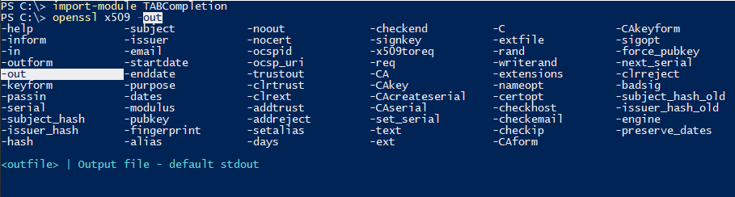

Command completion for classic commands in PowerShell

The PowerShell modules provide command completion for classic executables in PowerShell.

## How to use these files?
- Run `$env:PSModulePath` in PowerShell
- Place the files in one of the module locations in a sub folder named `TABCompletion`
- Run `import-module TABCompletion` (to get this permanently, add the line to your `$profile`)
- The module TABCompletion is a wrapper, that will load any module named `*-TABComplete.psm1` in the same folder
- Now you should have tab completion for ssh and openssl parameters (enter `ssh <TAB>` or `ssh <Ctrl+Space>`)

## SSH
SSH-TABComplete.psm1 supports command completion for SSH parameters and known hosts, e.g. hosts in the known_hosts file (the hosts, you've public keys for) and your SSH config

## SCP
SCP-TABComplete.psm1 supports command completion for SCP parameters and known hosts, e.g. hosts in the known_hosts file (the hosts, you've public keys for) and your SSH config

## OpenSSL
OpenSSL-TABComplete.psm1 supports command completion for OpenSSL commands.
It's important to have the OpenSSL executable in your path, at OpenSSL commands are used to dynamically generate the help content.

